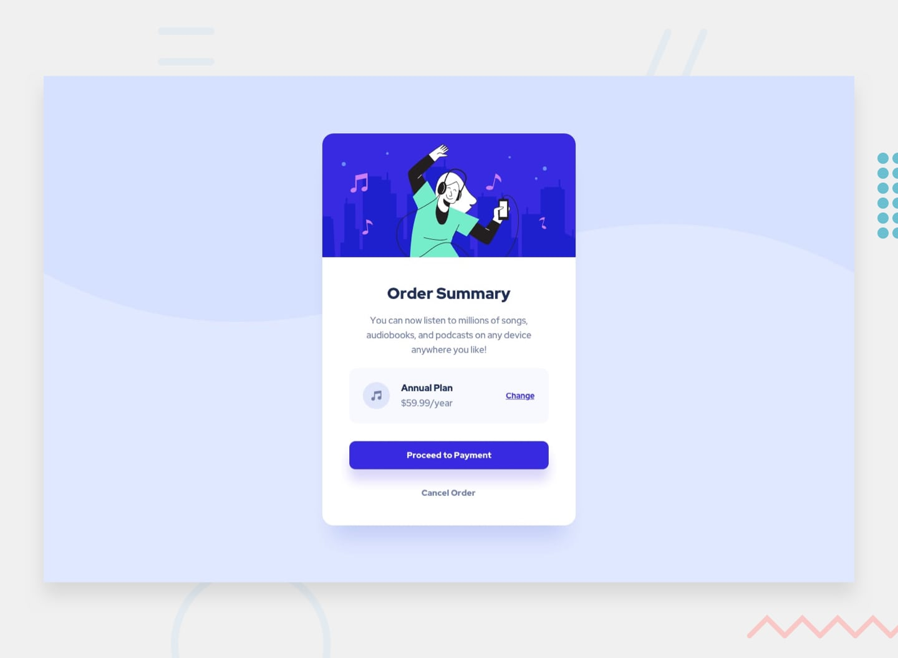

# Frontend Mentor - Order summary card solution

This is a solution to the [Order summary card challenge on Frontend Mentor](https://www.frontendmentor.io/challenges/order-summary-component-QlPmajDUj). Frontend Mentor challenges help you improve your coding skills by building realistic projects. 

## Table of contents

- [Overview](#overview)
  - [The challenge](#the-challenge)
  - [Screenshot](#screenshot)
  - [Links](#links)
- [My process](#my-process)
  - [Built with](#built-with)
  - [What I learned](#what-i-learned)
  - [Continued development](#continued-development)
  - [Useful resources](#useful-resources)
- [Author](#author)
- [Acknowledgments](#acknowledgments)

## Overview
Doing some funny stuff is the best way that I could use to practice and master my skills like a front end developer, in this case specifically CSS and HTML.

### The challenge

In this case I will work building a summary order component with CSS and HTML according to a design pre defined.

### Screenshot

### Built with
- Semantic HTML5 markup
- CSS custom properties
- Flexbox
- CSS Grid
- Mobile-first workflow

### What I learned
- Desktop-first workflow
- Basic CSS
  - Flexbox 
  - Pseudoselectors
- Semantic HTML5 markup
- CSS custom properties

## Author

- Instagram - [@jmeox](https://www.instagram.com/jemeox)
- Frontend Mentor - [@JesusMezaOrozco](https://www.frontendmentor.io/profile/JesusMezaOrozco)
